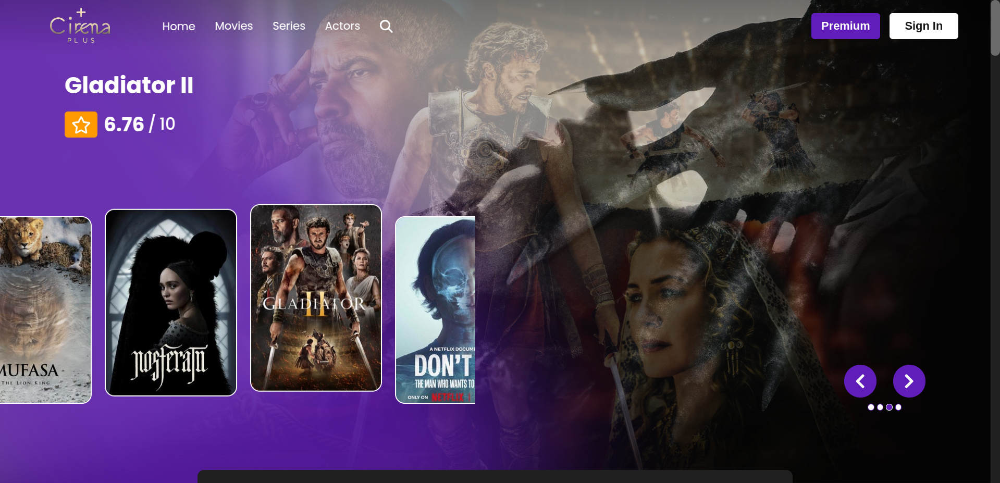
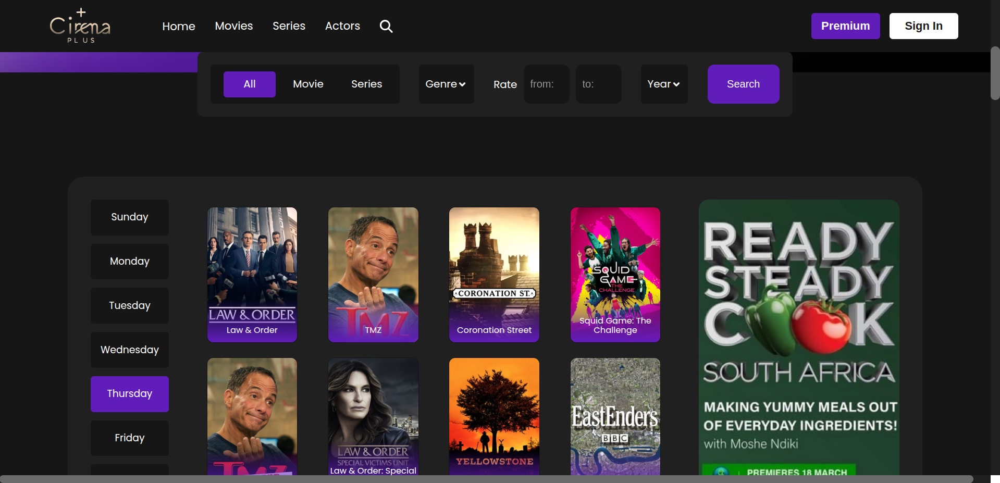
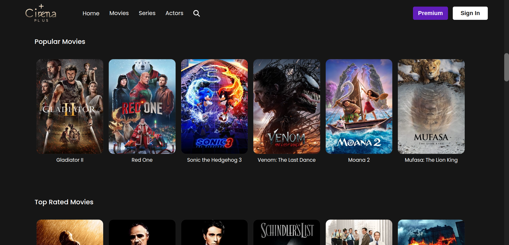
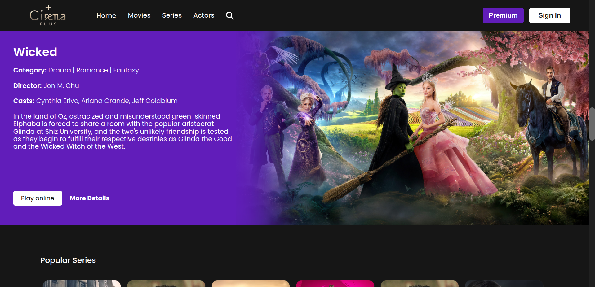
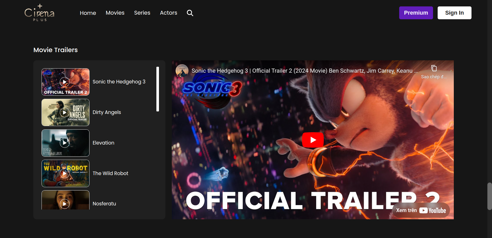
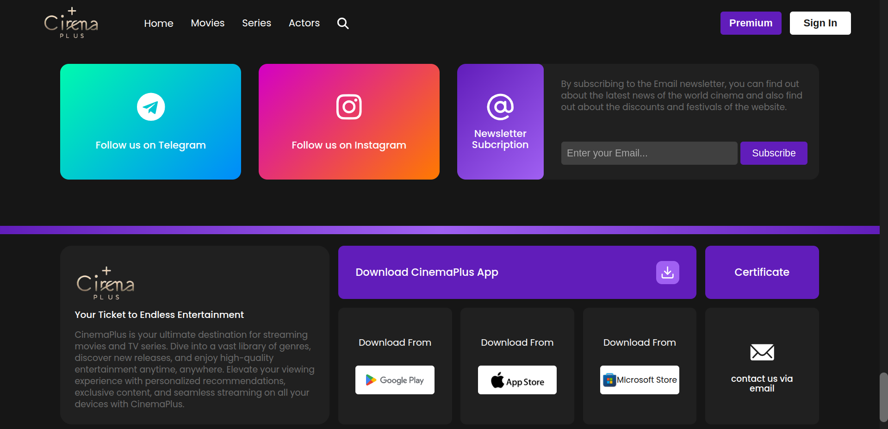
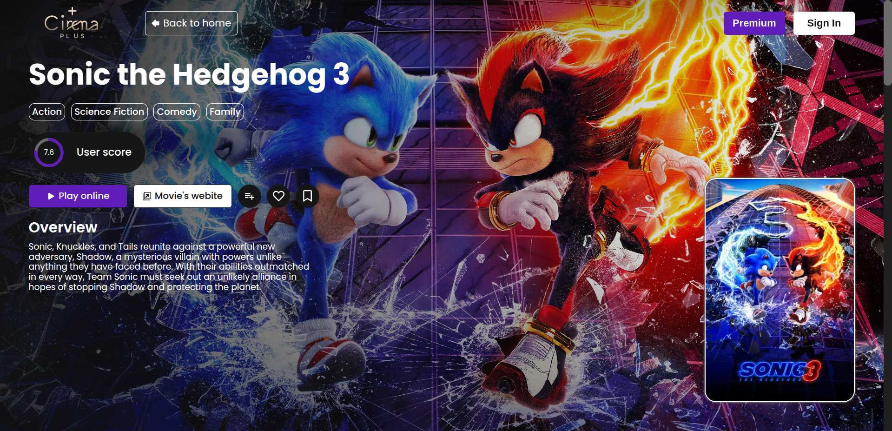
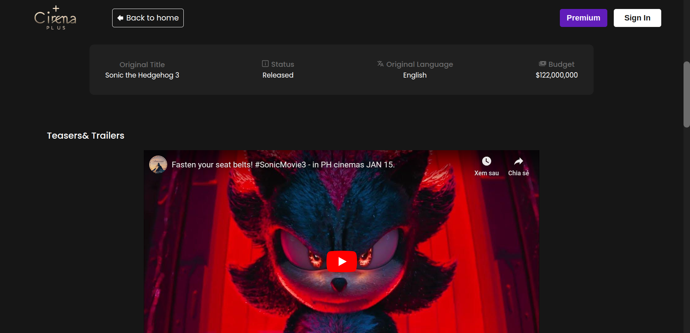
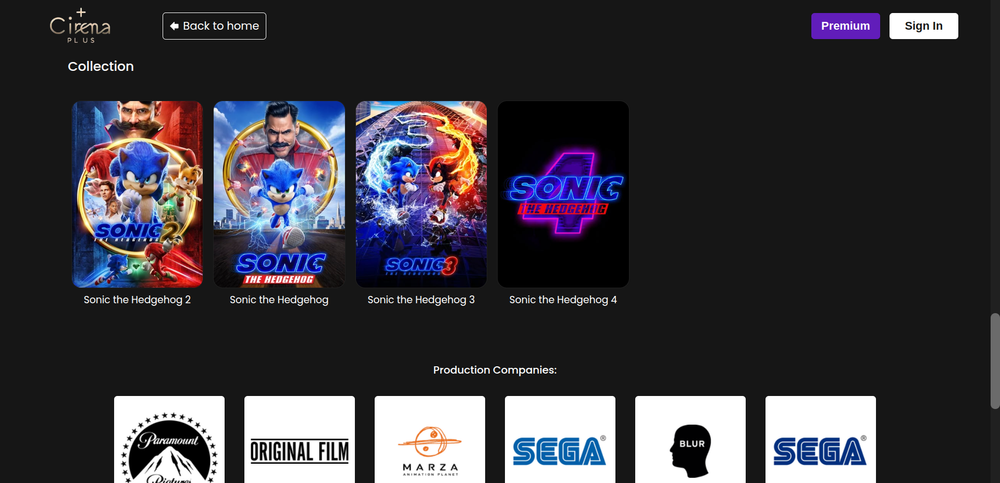

# CinemaPlus

CinemaPlus is a movie streaming platform built using the MERN stack (MongoDB, Express.js, React.js, and Node.js). Designed to provide an immersive cinematic experience, CinemaPlus allows users to discover, watch, and manage their favorite movies and shows effortlessly.

## Deployment
- **Live website**: [https://cinemaplus0201.netlify.app/](https://cinemaplus0201.netlify.app/)
  
**Note**: The server might take some time to respond due to free hosting limitations.

## References
- **Design reference**: [dribbble.com](https://dribbble.com/shots/24037692-Movie-Website-Case-Study)

## Screenshots

## Folder Structure
- **Backend/**: Contains the source code for the backend service.
- **Frontend/**: Contains the source code for the frontend application.

